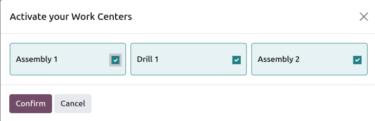
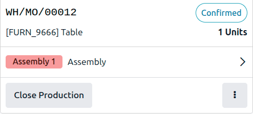
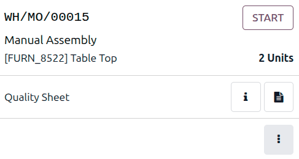
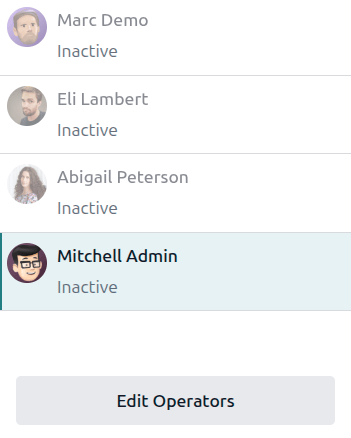
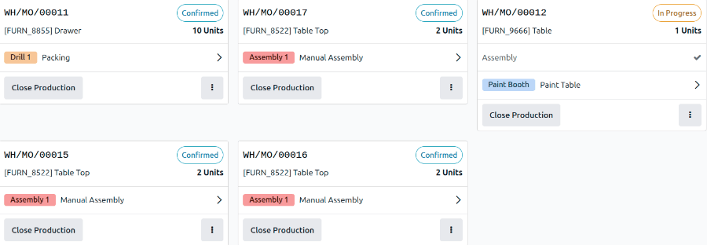

===================
Shop Floor overview
===================

.. _manufacturing/shop_floor/shop_floor_overview:
.. |MO| replace:: :abbr:`MO (Manufacturing Order)`
.. |MOs| replace:: :abbr:`MOs (Manufacturing Orders)`

The *Shop Floor* module is a companion module to the *Manufacturing* app. *Shop Floor* provides a
visual interface for processing manufacturing orders (MOs) and work orders. It also allows
manufacturing employees to track the amount of time spent working on manufacturing and work orders.

The *Shop Floor* module is installed alongside the *Manufacturing* app. To install the
*Manufacturing* app, navigate to :menuselection:`Apps`, search for `manufacturing` in the
:guilabel:`Search` bar, and then click :guilabel:`Install` on the :guilabel:`Manufacturing` app
card.

.. important::
   The *Shop Floor* module replaces the tablet view functionality of the *Manufacturing* app, and is
   only available in Odoo versions 16.4 and later.

   To check the version number of an Odoo database, navigate to :menuselection:`Settings` and scroll
   down to the :guilabel:`About` section at the bottom of the page. The version number is displayed
   there.

   To switch to a newer version of Odoo, see the documentation on :doc:`upgrading a database
   <../../../../administration/upgrade>`.

Opening Shop Floor
==================

*Shop Floor* can be opened in the following ways:

- Click the :guilabel:`Shop Floor` module icon from the main Odoo dashboard.
- Click the :icon:`oi-view-kanban` :guilabel:`Shop Floor` smart button on a manufacturing order.
  This will open the manufacturing order in the *Shop Floor* module.

Activating work centers
=======================

When *Shop Floor* is opened on a workstation, it is possible to select work centers to assign to it.

Open the *Shop Floor* app from either the main Odoo dashboard or from the :icon:`oi-view-kanban`
:guilabel:`Shop Floor` smart button on a manufacturing order.

If it is the workstation's first time opening *Shop Floor*, the database may prompt the operator to
:guilabel:`Activate your Work Centers`. If work centers are already assigned and more must be added,
click the :guilabel:`Add` button next to the work center list.

In the *Activate your Work Centers* pop-up, select the work centers to assign to the workstation,
then click :guilabel:`Confirm`.

Installing Shop Floor on a workstation
======================================

*Shop Floor* can be installed in the Chrome browser of a workstation to limit its access to other
Odoo applications.

First, open the *Shop Floor* app from either the main Odoo dashboard or from the
:icon:`oi-view-kanban` :guilabel:`Shop Floor` smart button on a manufacturing order.

Click the :icon:`fa-navicon` :guilabel:`(menu)` icon, then click :icon:`fa-arrow-circle-down`
:guilabel:`Install App`. A new window will open. Click the :guilabel:`Install` button to install the
app in the workstation's browser.

Navigation
==========

*Shop Floor* is broken down into three main views, which can be selected from the navigation bar at
the top of the module:

- The :guilabel:`Overview` page serves as the module's main dashboard and displays information cards
  for |MOs|.
- Each work center also has a dedicated page that displays information cards for the work orders
  assigned to it. Work center pages can be toggled on or off by clicking the :guilabel:`Add` icon in
  the navigation bar, selecting or deselecting them on the pop-up window that appears, and then
  clicking :guilabel:`Confirm`.
- The :guilabel:`My WO` page shows information cards for all work orders assigned to the employee
  whose profile is currently active in the operator panel on the left side of the module. This page
  functions largely the same as the pages for each work center, but it only shows work orders
  assigned to the active employee.

.. tip::
   To isolate an |MO| or work order, so that no other orders appear, search the reference number of
   the |MO| in the :guilabel:`Search` bar at the top of the module. This search filter remains
   active while switching between the different module views.

On the left side of the module is the operator panel, which shows all of the employees currently
signed in to *Shop Floor* and allows new employees to sign in. The operator panel is always
available in the module, regardless of the selected view.

Overview page
-------------

By default, the *Overview* page shows an information card for every |MO| that is *ready to start*.
An |MO| is considered ready to start once it has been confirmed, and all required components are
available.

To view every confirmed |MO| regardless of readiness, click the :icon:`oi-close` :guilabel:`(close)`
icon on the :guilabel:`MO Ready` filter to remove it from the :guilabel:`Search` bar.

MO information card
~~~~~~~~~~~~~~~~~~~

An |MO| information card on the *Overview* page displays all of the relevant details of the
associated |MO|, and also provides employees with options for processing the |MO|.

The header for an |MO| card shows the |MO| number, the product and number of units being produced,
and the |MO| status. If work on the MO has not yet begun, the status appears as
:guilabel:`Confirmed`. When work has begun, the status updates to :guilabel:`In Progress`.

The main body of an |MO| card shows a line for each completed work order, if any, followed by the
current work order to be completed. Completed work orders appear in grey with a :icon:`fa-check`
:guilabel:`(checkmark)` icon next to it. The current work order is indicated by a button that opens
the page for the work center to which the order is assigned.

If a lot or serial number is required for the product, below the current work order is a line titled
:guilabel:`Register Production`, which records lot or serial numbers for the units produced. Click
the :guilabel:`Register Production` line to specify a lot or serial number for the produced units,
then click :guilabel:`Validate`.

The footer of the |MO| card displays a :guilabel:`Close Production` button. This is used to close
the |MO| once production is completed. However, if any quality checks are required for the |MO| as a
whole (not the work orders within it), a :guilabel:`Quality Checks` button appears instead. Clicking
:guilabel:`Quality Checks` opens a pop-up window where any required quality checks can be completed.

After clicking :guilabel:`Close Production`, the |MO| card disappears slowly and the work order is
closed.

On the right side of the footer is a :icon:`fa-ellipsis-v` :guilabel:`(vertical ellipsis)` button,
which opens a pop-up window with additional options for the |MO|:

- :guilabel:`Register Production / Serial`: Record lots of serial numbers for the units produced.
- :guilabel:`Scrap`: Send components to a scrap location when they are found to be defective.
- :guilabel:`Add Work Order`: Add an additional work order to the |MO|.
- :guilabel:`Add Component`: Add an additional component to the |MO|.

  .. note::
   Additional components are consumed in the *Shop Floor* module, but their stock moves will not be
   validated until the |MO| is closed.

- :guilabel:`Add By-product`: Add a product that will be created as a byproduct of this work order.
- :guilabel:`Open Manufacturing Order`: opens the |MO| in the *Manufacturing* app.
- :guilabel:`Log Note`: Enter a note that will be visible in the *Shop Floor* module and throughout
  all steps on the shop floor.

Work center pages
-----------------

By default, the page for each work center shows an information card for every work order assigned to
it that is *ready to start*. A work order is considered ready to start when the |MO| it is a part of
is ready to start, and any preceding work orders have been completed.

To view every confirmed work order assigned to a work center regardless of readiness, click the
:icon:`oi-close` :guilabel:`(remove)` icon on the :guilabel:`MO Ready` filter to remove it from the
:guilabel:`Search` bar.

Work order information card
~~~~~~~~~~~~~~~~~~~~~~~~~~~

The work order information cards on a work center's page show all of the relevant details of the
associated work order and also provide employees with options for processing it.

The header for a work order card shows the reference number of the |MO| that the work order is a
part of, the product and number of units being produced. Operators can click the :guilabel:`Start`
button to start work on a work order. When work has begun, the status updates to display a timer
showing the total time the work order has been worked on. The instructions for each work order open
automatically when the timer starts.

The main body of a work order card shows a line for each step required to complete the work order.
Work order steps can be completed by the button for the line, then following the instructions on the
pop-up window that appears.

If there are instructions to follow for a work order, they display in the work order. To complete a
step, click the instruction line and follow the instructions. The instructions that follow an
individual instruction will automatically open.

If the work order being processed is the final work order for the |MO|, a :guilabel:`Close
Production` button appears on the footer of the work order card. Clicking :guilabel:`Close
Production` closes both the work order and the |MO|, unless a quality check is required for the
|MO|. In this case, the quality check must be completed from the |MO| card before the |MO| can be
closed.

Alternatively, if the |MO| requires the completion of additional work orders, a :guilabel:`Mark as
Done` button appears instead. Clicking :guilabel:`Mark as Done` marks the current work order as
completed, and causes the next work order to appear on the page for the work center it is assigned
to.

After clicking :guilabel:`Close Production` or :guilabel:`Mark as Done`, the work order card fades
away. When the work order card disappears completely, the work order is marked as
:guilabel:`Finished` on the |MO|.

On the right side of the footer is a :icon:`fa-ellipsis-v` :guilabel:`(vertical ellipsis)` button,
which opens a pop-up window with additional options for the work order:

- :guilabel:`Register Production/Serial`: records lot or serial numbers for the units produced.
- :guilabel:`Scrap`: sends components to a scrap location when they are found to be defective.
- :guilabel:`Modify Routing`: allows the operator to move the work order to another work center or
  to add another work order
- :guilabel:`Add Component`: adds an additional component to the |MO|.
- :guilabel:`Open Manufacturing Order`: opens the associated |MO| in the *Manufacturing* app
- :guilabel:`Update instructions`: allows the user to propose a change to the work order's
  instructions or steps.
- :guilabel:`Create a Quality Alert`: opens a quality alert form that can be filled out to alert a
  quality team about a potential issue
- :guilabel:`Request Maintenance`: creates a maintenance request for the work center

Operator panel
--------------

The operator panel is used to manage the employees who are signed in to the *Shop Floor* module.
The panel displays the name and profile picture of every employee currently signed in across all
database instances.

To interact with *Shop Floor* as a specific employee, click the employee's name to activate their
profile. Inactive profiles appear with their names and profile pictures greyed out.

When an employee is selected in the operator panel, they can begin working on a work order by
clicking the work order's heading. If an employee is working on one or more work orders, the work
order titles appear under their name, as well as a timer showing how long they've been working on
each order.

To add new employees to the operator panel, click the :guilabel:`Edit Operators` button at the
bottom of the panel. Then, select employees from the :guilabel:`Edit Operators` pop-up window. Click
:guilabel:`Done` to save the list of operators.

To remove an employee from the operator panel, click the :guilabel:`Edit Operators` button, deselect
the employee, then click :guilabel:`Done`.

MO/WO prioritization
====================

The *Shop Floor* module prioritizes orders based on their *scheduled date*. An order can be moved to
the top of the list by clicking the :icon:`fa-star-o` :guilabel:`(star)` icon in the |MO| form.
|MOs| and work orders scheduled sooner are more highly prioritized and appear before orders which
are scheduled further out.

To specify the scheduled date on an |MO|, begin by navigating to :menuselection:`Manufacturing app
--> Operations --> Manufacturing Orders`, and click :guilabel:`New` to create a new |MO|.

Click on the :guilabel:`Scheduled Date` field to open a calendar popover window. By default, the
:guilabel:`Scheduled Date` field and its corresponding pop-up window show the current date and time.

Use the calendar to select the date on which processing should begin for the |MO|. In the two fields
at the bottom of the popover window, enter the hour and minute at which processing should begin,
using the 24-hour clock format.

Finally, click :guilabel:`Apply` at the bottom of the popover window to set the date and time for
the :guilabel:`Scheduled Date` field. Then, click the :guilabel:`Confirm` button at the top of the
|MO| to confirm it.

Once the |MO| is confirmed, it appears in the *Shop Floor* module, as long is it has the
:guilabel:`Ready` status, which means all components are available.

On the Odoo dashboard, click on the :menuselection:`Shop Floor` module to open it. The *Overview*
page of the dashboard displays *Ready* |MOs|, organized in order of priority on their |MO| form,
then their scheduled dates.

At the top of the module, select a work center to see the work orders assigned to it. The page for
each work center organizes work orders, based on the scheduled dates of their corresponding |MOs|.

.. example::
   Three |MOs| are confirmed for a *Table* product:

   - WH/MO/00018 has a :guilabel:`Scheduled Date` of March 31.
   - WH/MO/00019 has a :guilabel:`Scheduled Date` of April 9.
   - WH/MO/00020 has a :guilabel:`Scheduled Date` of April 3.

   On the *Overview* page of the *Shop Floor* module, the cards for each |MO| appear in this order:
   WH/MO/00018, WH/MO/00020, WH/MO/00019.

   .. image:: shop_floor_overview/mo-order.png
      :alt: MOs in the Shop Floor module, ordered by their scheduled date.

   Each |MO| requires one work order, carried out at :guilabel:`Assembly 1`. Clicking on the
   :guilabel:`Assembly 1` button at the top of the screen opens the page for the work center, which
   displays one card for each work order, appearing in the same order as their corresponding |MOs|.
