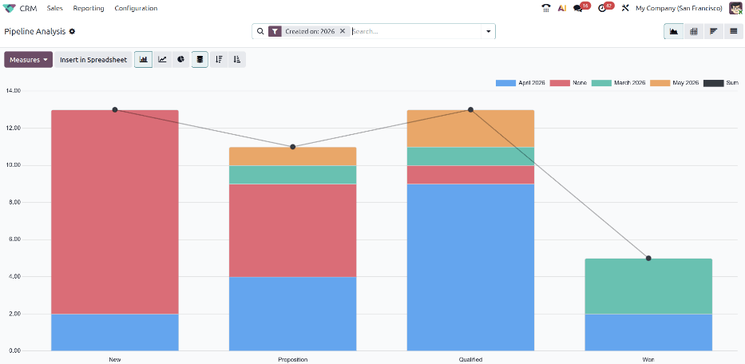
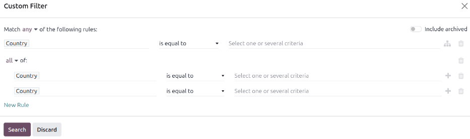
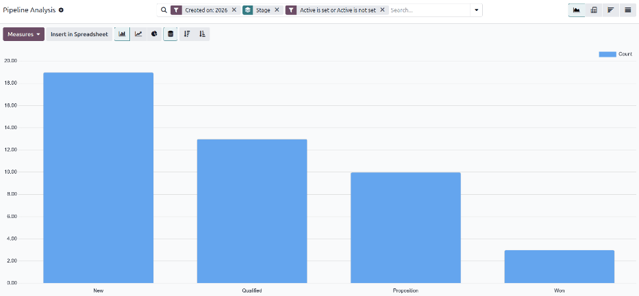
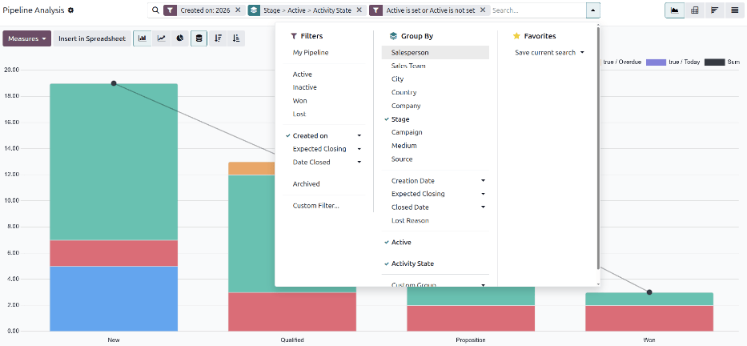
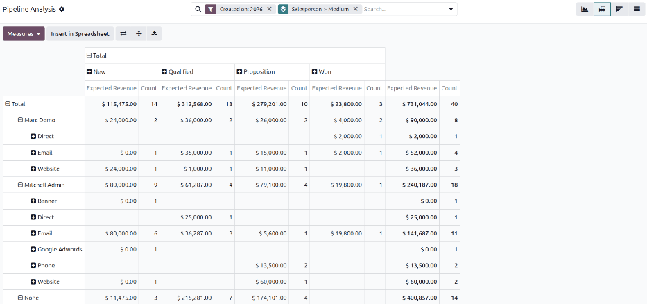

=================
Pipeline Analysis
=================

The *CRM* app manages the sales pipeline as leads and opportunities move from stage to stage,
ultimately being either won or lost. After organizing the pipeline, the search options and reports
available on the *Pipeline Analysis* page can be used to gain insight into the effectiveness of the
pipeline and its users.

.. _win_loss/pipeline:

Pipeline analysis reports
=========================

To view the *Pipeline Analysis* page, go to :menuselection:`CRM app --> Reporting --> Pipeline`. A
stacked bar chart showcasing all leads created during the current year automatically loads. The bars
represent the number of leads currently in each stage of the sales pipeline, color-coded to show the
month the lead reached that stage.

The interactive elements of the :guilabel:`Pipeline Analysis` page manipulate the graph to report
different metrics in different views. In the upper-right corner, there are view options represented
by different icons.

- :guilabel:`Graph` view: Displays the data in a bar graph, allowing for quick visual comparisons of
  data across CRM stages. This is the default view.
- :guilabel:`Pivot` view: Displays the data in a customizable categorized metrics table, allowing
  for breakdowns of CRM data into specific categories or groups for more preceise analysis.
- :guilabel:`Cohort` view: Displays and organizes the data based on their :guilabel:`Created on` and
  :guilabel:`Closed Date` week, day, month, quarter, or year. This allows for easy identification of
  patterns over certain time periods. Week is the default setting.
- :guilabel:`List` view: Displays the data as a list of opportunities, allowing for easy viewing of
  detailed individual records.

.. _win_loss/search:

Filters and groupings
=====================

The :guilabel:`Pipeline Analysis` page can be customized with various filters and grouping options.

Filters
-------

The :guilabel:`Filters` section allows users to add pre-made and custom filters to the search
criteria. Multiple filters can be added to a single search.

- :guilabel:`My Pipeline`: Show leads assigned to the current user.
- :guilabel:`Active`: Show active leads.
- :guilabel:`Inactive`: Show inactive leads.
- :guilabel:`Won`: Show leads that have been marked *Won*.
- :guilabel:`Lost`: Show leads that have been marked *Lost*.
- :guilabel:`Created on`: Show leads that were created during a specific period of time. The default
  time period is the past year, but it can be adjusted as needed.
- :guilabel:`Expected Closing`: Show leads that are projected to close during a specific period of
  time. Closed leads are marked as having been *Won*.
- :guilabel:`Date Closed`: Show leads that have been marked *Won* during a specific period of time.
- :guilabel:`Archived`: Show leads that have been archived. Archived leads are marked *Lost*, but
  not all *Lost* leads are archived.
- :guilabel:`Custom Filter`: Allows the user to create a custom filter with numerous options. See
  :ref:`Add Custom Filters and Groups <win_loss/custom_filters>` for more information.

Additionally, the following options appear if the *Leads* option has been enabled in the **CRM**
app's Configuration settings.

- :guilabel:`Opportunities`: Show leads that have been qualified as opportunities.
- :guilabel:`Leads`: Show leads that have yet to be qualified as opportunities.

Groupings
---------

The :guilabel:`Group By` section allows users to add pre-made and custom groupings to the search
results. Multiple groupings can be added to split results into more manageable chunk

.. important::
   The order that groupings are added affects how the final results are displayed. Try selecting the
   same combinations in a different order to see what works best for each use case.

- :guilabel:`Salesperson`: Groups the results by the Salesperson to whom a lead is assigned.
- :guilabel:`Sales Team`: Groups the results by the Sales Team to whom a lead is assigned.
- :guilabel:`City`: Groups the results by the city from which a lead originated.
- :guilabel:`Country`: Groups the results by the country from which a lead originated.
- :guilabel:`Company`: Groups the results by the company to which a lead belongs, if multiple
  companies are activated in the database.
- :guilabel:`Stage`: Groups the results by the stages of the sales pipeline.
- :guilabel:`Campaign`: Groups the results by the marketing campaign from which a lead originated.
- :guilabel:`Medium`: Groups the results by the medium (Email, Google Adwords, Website, etc.) from
  which a lead originated.
- :guilabel:`Source`: Groups the results by the source (Search engine, Lead Recall, Newsletter,
  etc.) from which a lead originated.
- :guilabel:`Creation Date`: Groups the results by the date a lead was added to the database.
- :guilabel:`Conversion Date`: Groups the results by the date a lead was converted to an
  opportunity.
- :guilabel:`Expected Closing`: Groups the results by the date a lead is expected to close. Closed
  leads are marked as having been *Won*
- :guilabel:`Closed Date`: Groups the results by the date a lead was marked *Won*.
- :guilabel:`Lost Reason`: Groups the results by the reason selected when a lead was marked *Lost*.
- :guilabel:`Custom Group`: Allows the user to create a custom group with numerous options. See
  :ref:`Adding Custom Filters and Groups <win_loss/custom_filters>` for more information.

Favorites
---------

The :guilabel:`Favorites` section allows users to save regularly performed searches for later, so
that they don't need to be recreated every time. Multiple sets of search terms can be saved, shared
with others, or even set as the default for whenever the :guilabel:`Pipeline Analysis` page is
opened.

- :guilabel:`Save current search`: save the current search criteria for later.
- :guilabel:`Default filter`: when saving a search, check this box to make it the default search
  filter when the :guilabel:`Pipeline Analysis` page is opened.
- :guilabel:`Shared`: when saving a search, check this box to make it available to other users.

.. _win_loss/custom_filters:

Custom filters and groups
-------------------------

In addition to the default options in the search bar, the :guilabel:`Pipeline Analysis` page can
also utilize custom filters and groups. Custom filters are complex rules that further customize the
search results, while custom groups display the information in a more organized fashion.

Adding a custom filter
~~~~~~~~~~~~~~~~~~~~~~

To add a custom filter, go to the :guilabel:`Pipeline Analysis` page. , click the
:icon:`fa-sort-down` :guilabel:`(Toggle Search Panel)` icon next to the :guilabel:`Search...` bar.
In the drop-down menu, click :guilabel:`Custom Filter`. The :guilabel:`Custom Filter` pop-up window
appears with a default rule comprised of three unique fields. These fields can be edited to make a
custom rule and multiple rules can be added to a single custom filter.

To edit a rule, start by clicking the first field and select an option from the drop-down menu. The
first field determines the primary subject of the rule. Next, click the second field and select an
option from the drop-down menu. The second field determines the relationship of the first and third
fields and is usually some form of an "is" or "is not" statement. Finally, click the third field and
select an option from the drop-down menu. The third field determines the secondary subject of the
rule. With all three fields selected, the rule is complete.

- To create more complex rules, click the :icon:`fa-sitemap` :guilabel:`(Add nested rule)` icon to
  the right of the rule. This adds another modifier below the rule for adding an "all of" or "any
  of" statement, as well as an :icon:`fa-plus` :guilabel:`(Add rule)` icon for adding additional
  sub-rules

Once all rules have been added, click :guilabel:`Search` to add the custom filter to the search
criteria.

Adding a custom group
~~~~~~~~~~~~~~~~~~~~~

On the :guilabel:`Pipeline Analysis` page, click the :icon:`fa-sort-down` :guilabel:`(Toggle Search
Panel)` icon next to the search bar. In the drop-down menu that appears, click :guilabel:`Custom
Group`. Scroll through the options in the drop-down menu, and select one or more groups.

.. _win_loss/measure:

Measurement options
===================

By default, the :guilabel:`Pipeline Analysis` page measures the total *Count*, or number of leads,
for the current year. It can be modified to present other pipeline metrics.

To change the displayed leads, click the :guilabel:`Measures` button in the top-left of the page and
select one of the following options from the drop-down menu:

- :guilabel:`Days to Assign`: Measures the number of days it took a lead to be assigned after
  creation.
- :guilabel:`Days to Close`: Measures the number of days it took a lead to be closed. Closed leads
  are marked as having been *Won*.
- :guilabel:`Days To Convert`: Measures the number of days it took a lead to be converted to an
  opportunity.
- :guilabel:`Exceeded Closing Days`: Measures the number of days by which a lead exceeded its
  expected closing date.
- :guilabel:`Expected Revenue`: Measures the expected revenue of a lead.
- :guilabel:`Prorated Revenue`: Measures the prorated revenue of a lead.
- :guilabel:`Count`: Measures the total amount of leads that match the search criteria.

If the **Subscriptions** app has been installed to the Odoo database, the following options also
appear under :guilabel:`Measures`.

- :guilabel:`Expected MRR`: Measures the expected monthly recurring revenue of a lead.
- :guilabel:`Prorated MRR`: Measures the prorated monthly recurring revenue of a lead.
- :guilabel:`Prorated Recurring Revenues`: Measures the prorated recurring revenues of a lead.
- :guilabel:`Recurring Revenues`: Measures the recurring revenue of a lead.

.. _win_loss/reports:

Create reports
==============

After understanding how to :ref:`navigate the pipeline analysis page <win_loss/pipeline>`, the
:guilabel:`Pipeline Analysis` page can be used to create and share different reports. Between the
pre-made options and custom filter and groupings, almost any combination is possible.

Win/Loss reports are a calculation of active or previously active leads in a pipeline that were
either marked as *Won* or *Lost* over a specific period of time. By calculating opportunities won
vs. opportunities lost, teams can identify what's driving conversions, such as specific teams or
team members, certain marketing mediums or campaigns, and so on.

.. math::
   \begin{equation}
   Win/Loss Ratio = \frac{Opportunities Won}{Opportunities Lost}
   \end{equation}

A win/loss report filters the leads from the current year by default, whether won or lost, and
groups the results by their stage in the pipeline. Creating this report requires a custom filter and
grouping the results by :guilabel:`Stage`.

To create a win/loss report, navigate to :menuselection:`CRM app --> Reporting --> Pipeline`. On the
:guilabel:`Pipeline Analysis` page, click the :icon:`fa-sort-down` :guilabel:`(Toggle Search Panel)`
icon at the end of the search bar to open a drop-down menu of filters and groupings. Click
:guilabel:`Stage` under the :guilabel:`Group By` heading. Next, click :guilabel:`Custom Filter`
under the :guilabel:`Filters` heading and :guilabel:`Custom Filter` pop-up loads. Click on the first
field in the :guilabel:`Match any of the following rules:` section and select :guilabel:`Active`.
Doing so automatically sets the second field to :guilabel:`is set`. Add another rule by clicking
:guilabel:`New Rule`, then set the first field to :guilabel:`Active` and the second field to
:guilabel:`is not set`, then click :guilabel:`Search`.

The report now displays the total :guilabel:`Count` of both *Won* and *Lost* leads grouped by their
stage in the CRM pipeline. Hover over a section of the report to see the number of leads in that
stage.

Custom win/loss reports
-----------------------

Win/loss reports can be customized to present different information for different needs. For
example, a sales manager might find it useful to group wins and losses by salesperson or sales team
to see who has the best conversion rate. A marketing team might group by sources or medium to
determine where their advertising has been most successful. Here are some of the functions that
allow for the creation of custom reports like marketing campaign analysis and in-depth looks at the
status and journey of individual opportunities.

Filters and groups
~~~~~~~~~~~~~~~~~~

To add more filters and groups, click the :icon:`fa-sort-down` :guilabel:`(Toggle Search Panel)`
icon, next to the search bar and select one or more options from the drop-down menu.

Some useful options include:

- :guilabel:`Created on`: Adjust this filter for results for specific periods of time.
- :guilabel:`Custom Filter`: Click this option to add additional search criteria, like
  :guilabel:`Last Stage Update` or :guilabel:`Lost Reason`.
- :guilabel:`Custom Group`: Click :menuselection:`Add Custom Group --> Active` to separate the
  results and show at what stages leads are being marked as *Won* or *Lost*.

It's possible to add multiple :guilabel:`Group By` selections to split results into more relevant
and manageable chunks.

- Adding :guilabel:`Salesperson` or :guilabel:`Sales Team` breaks up the total count of leads in
  each :guilabel:`Stage`.
- Adding :guilabel:`Medium` or :guilabel:`Source` can reveal what marketing avenues generate more
  sales.

Pivot View
~~~~~~~~~~

By default, pivot view groups win/loss reports by :guilabel:`Stage` and measures :guilabel:`Expected
Revenue`.

To flesh out the table, click the :icon:`fa-sort-down` :guilabel:`(Toggle Search Panel)` icon next
to the search bar. In the pop-up menu, choose a grouping like :guilabel:`Salesperson` or
:guilabel:`Medium`. Click the :guilabel:`Measures` button and click :guilabel:`Count` to add the
number of leads to the report. Other useful measures for the pivot view include :guilabel:`Days to
Assign` and :guilabel:`Days to Close`.

.. important::
   In pivot view, the :guilabel:`Insert In Spreadsheet` button may be greyed out due to the report
   containing duplicate grouping options. To fix this, remove the :guilabel:`Stage` grouping in the
   search bar.

List View
~~~~~~~~~

In list view, a win/loss report displays all leads on a single page.

To better organize the list, click the :icon:`fa-sort-down` :guilabel:`(Toggle Search Panel)` next
to the search bar and add more relevant groupings or re-organize the existing ones. To re-order the
nesting, remove all :guilabel:`Group By` options and re-add them in the desired order.

To add more columns to the list, click the :icon:`oi-settings-adjust` icon in the top-right of the
page. Select options from the resulting drop-down menu. Some useful filters include:

- :guilabel:`Campaign`: Shows the marketing campaign that originated each lead.
- :guilabel:`Medium`: Shows the marketing medium (Banner, Direct, Email, Google Adwords, Phone,
  Website, etc.) that originated each lead.
- :guilabel:`Source``: Shows the source of each lead (Newsletter, Lead Recall, Search Engine, etc.).

.. seealso::
   - :doc:`../acquire_leads/convert`
   - :doc:`../acquire_leads/send_quotes`
   - :doc:`../pipeline/lost_opportunities`
