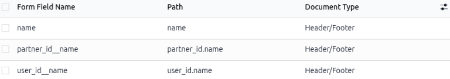

.. _Adobe: https://helpx.adobe.com/acrobat/desktop/work-with-pdf-forms/create-forms/convert-to-forms.html

================================
Configuring dynamic text in PDFs
================================

While creating custom PDFs for quotes, use *dynamic text* for Odoo to auto-fill the PDF content with
information related to the quote from the Odoo database, like names, prices, etc.

Dynamic text values are form components (text inputs) that can be added in a PDF file, and Odoo
automatically fills those values in with information related to the quote.

Design tips
===========

When designing the base PDF template for a quote’s header or footer, keep the dynamic text placement
in mind. Use the following tips to avoid overlapping text and poor design:

* **Leave Whitespace**: Ensure there is enough room for dynamic data to expand without overlapping
  logos or borders.
* Place dynamic fields, like Customer Name, on their own lines. Alternatively, put them at the end
  of phrases to avoid text breaking. Long names can push static text out of alignment.
* **Set a default font**: Configuring a universally available default font maintains a consistent
  text appearance when adding or editing content.

Edit PDF forms with Adobe software. Form fields in header and footer templates are required to
retrieve dynamic values in Odoo.

.. tip::
   If the PDF is too large for email, try using "System Fonts" (Arial, Helvetica, Times New Roman)
   instead of custom Google fonts to avoid large embedded file sizes.

Prepare the dynamic text fields
===============================

To add dynamic text fields to a PDF, open the preferred PDF editor, like Adobe Acrobat Pro or
Scribus.

Adobe Acrobat Pro
-----------------

First, `convert the PDF into a PDF form <Adobe_>`_. Then add a text field at the location where the
Odoo information needs to be displayed. Link the Odoo variables to the text fields by
double-clicking on the field to open :guilabel:`Properties`.

In the :guilabel:`General tab`, enter the Odoo field variable for the :guilabel:`Name`. Set the
:guilabel:`Common Properties` to :guilabel:`Visible` unless the field needs to be hidden until data
is populated.

Next, click the :guilabel:`Appearance` tab` and select the :guilabel:`Font Size`, :guilabel:`Font
Choice`, and :guilabel:`Text Color` to match the template's existing text or branding. Click the
:guilabel:`Options` tab and set the text alignment to match the template’s design.

.. tip::
   Refer to the :ref:`pdf_quote_builder/dynamic_text/common-dynamic-text-values` section for usual
   Odoo field variables and how to find a specific field value in Odoo.

General PDF editor instructions
-------------------------------

Open the desired PDF in the chosen PDF editor app. Then add a text field at the location where the
Odoo information needs to be displayed. Link the Odoo variables to the text fields by opening the
field’s :guilabel:`Properties` window. Then, in the :guilabel:`Name` for that field, enter the Odoo
variable.

If possible, configure the :guilabel:`Font Size`, :guilabel:`Font Choice`, and :guilabel:`Text
Color` to match the template's existing text or branding. Click the :guilabel:`Options` tab and set
the text alignment to match the template’s design.

Link PDF text fields to Odoo fields
===================================

Once the PDF file(s) are complete, save them to the computer's hard drive, and proceed to upload
them to Odoo via :menuselection:`Sales app --> Configuration --> Headers/Footers`.

If the uploaded PDF contains configured text forms, Odoo will automatically detect them and display
the :guilabel:`Configure dynamic fields` link. This step connects any field name in the PDF to the
correct Odoo field by specifying the exact technical path (the database code) to the desired
information.

Click the :guilabel:`Configure dynamic fields` link to go to the :guilabel:`Form Fields` page. The
:guilabel:`Form Field Name` column is populated with the text fields from the PDF. The
:guilabel:`Path` column is where the Odoo field path needs to be specified for each form field.

To edit, click in the :guilabel:`Path` cell of the desired form field row and enter the dynamic text
value. Refer to the :ref:`pdf_quote_builder/dynamic_text/common-dynamic-text-values` section for
usual Odoo field variables and how to find a specific field value in Odoo.

.. note::
   Headers and footers starts from the current :guilabel:`sale_order` model. Product documents
   follow their path from :guilabel:`sale_order_line`.  Leaving the path empty fills the custom note
   directly from the specific quote.

.. _pdf_quote_builder/dynamic_text/common-dynamic-text-values:

Common dynamic text values
==========================

Below are common dynamic text values used in custom PDFs that are already mapped to the correct
fields, and what they represent.

Users can also enable :ref:`developer-mode` in Odoo and hover over the desired field to see its
technical name which is the :guilabel:`Field` value in the pop-up window.

For headers and footers PDF:

- :guilabel:`name`: Sales Order Reference
- :guilabel:`partner_id__name`: Customer Name
- :guilabel:`user_id__name`: Salesperson Name
- :guilabel:`amount_untaxed`: Untaxed Amount
- :guilabel:`amount_total`: Total Amount
- :guilabel:`delivery_date`: Delivery Date
- :guilabel:`validity_date`: Expiration Date
- :guilabel:`client_order_ref`: Customer Reference

For product PDF:

- :guilabel:`description`: Product Description
- :guilabel:`quantity`: Quantity
- :guilabel:`uom`: Unit of Measure (UoM)
- :guilabel:`price_unit`: Price Unit
- :guilabel:`discount`: Discount
- :guilabel:`product_sale_price`: Product List Price
- :guilabel:`taxes`: Taxes name joined by a comma (`,`)
- :guilabel:`tax_excl_price`: Tax Excluded Price
- :guilabel:`tax_incl_price`: Tax Included Price

.. example::
   When a PDF is built, it's best practice to use common dynamic text values
   (:guilabel:`user_id_name`, :guilabel:`partner_id_name`, and :guilabel:`name`). When uploaded into
   the database, Odoo auto-populates those fields with the information from their respective fields.

   In this case, Odoo would auto-populate the Salesperson's name in the :guilabel:`user_id_name`
   dynamic text field, the Sales Order Reference in the :guilabel:`name` field, and the Customer
   Name in the :guilabel:`partner_id_name` field.

   .. image:: dynamic_text/pdf-quote-builder-sample.png
      :align: center
      :alt: PDF quote being built using common dynamic placeholders.

.. example::
   When uploading PDF containing the form field :guilabel:`invoice_partner_country`, which is an
   information available in the sales order, configure the :guilabel:`path` of the :guilabel:`Form
   Field Name` to:

   - :guilabel:`partner_invoice_id.country_id.name` for a header or footer document
   - :guilabel:`order_id.partner_invoice_id.country_id.name` for a product document fills the form
     with the invoice partner country's name when the PDF is built.

.. example::
   When uploading any PDF containing the form field :guilabel:`custom_note`, leaving the
   :guilabel:`path` empty allows the seller to write down any note where that form field is in that
   document and shown when the PDF is built.
